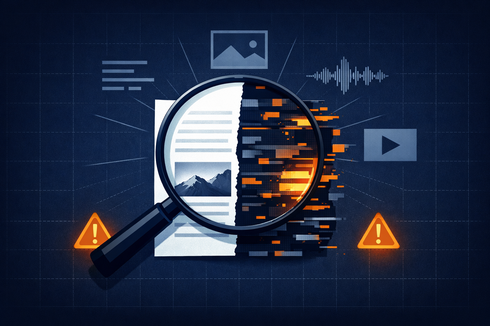

# The Verification Crisis

**Expert survey on GenAI disinformation - the shared instrument behind our publications on threat perception and mitigation**

[](https://forms.gle/BCwYFtfqxmZewkL97)
[](https://doi.org/10.37016/mr-2020-205)
[](https://doi.org/10.1145/3774905.3795484)
[](https://arxiv.org/abs/2602.02100)
[](https://opensource.org/licenses/MIT)
[](https://github.com/aloth/olcli)
[](https://mastodon.social/@xlth)

<p align="center">
  
</p>

---

## Call for Expert Participation

> *"We are at a critical inflection point. GenAI has reduced the cost of producing disinformation to near-zero. Your expertise matters."*

We are conducting a **longitudinal research study** to understand how experts perceive the evolving threat landscape of AI-generated disinformation. Waves 1 and 2 are closed and published (see [Study Waves](#study-waves)). The survey **remains open** for further responses: additional submissions accumulate toward a possible Wave 3. No Wave 3 publication is currently planned, but the larger the expert sample grows, the more analysis it can support.

<p align="center">
  <a href="https://forms.gle/BCwYFtfqxmZewkL97">
    
  </a>
</p>

### Who Should Participate?

We are seeking **domain experts** with professional experience in:

| Domain | Examples |
|--------|----------|
| **AI/ML Research & Engineering** | Researchers working on LLMs, diffusion models, synthetic media detection |
| **Cybersecurity** | Threat intelligence, adversarial ML, platform security |
| **Digital Policy & Regulation** | Policymakers, regulators, governance specialists (EU AI Act, DSA, etc.) |
| **Journalism & Fact-Checking** | Investigative journalists, fact-checkers, media analysts |
| **Computational Social Science** | Researchers studying online behavior, misinformation dynamics |
| **Ethics & Law** | AI ethicists, legal scholars focused on synthetic media |

### Why Participate?

- **Shape the research:** Your insights directly inform academic findings and policy recommendations
- **GDPR-compliant & anonymous:** Responses are anonymized; optional attribution in acknowledgments
- **Time commitment:** Approximately 15 minutes
- **Stay informed:** Receive a summary of findings upon publication

### Survey Instrument

The expert survey questionnaire is available in two formats:

- **Online:** [Google Forms](https://forms.gle/EUdbkEtZpEuPbVVz5)
- **Printable PDF:** [survey-print.pdf](survey-print.pdf) (generated from [LaTeX source](appendices/survey-questionnaire.tex))

---

## Key Concepts

| Concept | Definition |
|---------|------------|
| **Verification Crisis** | The structural shift where GenAI reduces the cost of producing high-fidelity disinformation toward zero, risking the erosion of shared factual basis in democratic deliberation |
| **Epistemic Fragmentation** | The breakdown of a shared reality as personalized synthetic content creates isolated information bubbles |
| **Synthetic Consensus** | The artificial manufacture of apparent agreement through AI-generated content simulating public opinion |
| **Reproducible Provenance** | Transparent, standardized infrastructure for verifying information origins—treating information integrity as infrastructure |

---

## Study Waves

The survey is longitudinal and **cumulative**: each wave reports the full sample collected to date, so Wave 2 includes all Wave 1 respondents. The waves are not disjoint samples, and the totals must not be added together.

| Wave | N (cumulative) | New in wave | Collection period | Publications |
|---|---|---|---|---|
| **Wave 1** | 21 | 21 | Jul 2025 - Dec 2025 | WWW '26 Companion (R2CASS) |
| **Wave 2** | 54 | +33 | Jan 2026 - Mar 2026 | HKS Misinformation Review 7(4); AIES 2026 |
| **Wave 3** | open | - | Ongoing | Optional; none planned |

All waves use the same instrument ([survey-questionnaire.tex](appendices/survey-questionnaire.tex)), so responses are directly comparable across waves.

## Datasets

The instrument covers 58 variables (7-point Likert scales, Best-Worst Scaling, open-ended responses). Two deposits exist, with different scopes and access models.

| Deposit | Wave | Contents | Access |
|---|---|---|---|
| [Harvard Dataverse `10.7910/DVN/BXO2QA`](https://doi.org/10.7910/DVN/BXO2QA) | Wave 2 (N=54) | De-identified responses (54 observations, 41 variables), aggregated tables, and the survey instrument, as published with the HKS Misinformation Review article | Open, CC0 1.0 |
| [Zenodo `10.5281/zenodo.18703600`](https://doi.org/10.5281/zenodo.18703600) | Latest (currently Wave 2) | Privacy-reduced response file. Concept DOI, always resolves to the newest version | Restricted to academic research; request via Zenodo |

Both deposits are privacy-reduced, and neither carries the identity columns. The Dataverse deposit holds the same 54 responses with 17 fewer variables (name, affiliation, profile link, timestamp and open-text fields), as published with the HKS Misinformation Review article. The Zenodo deposit from v2.1.0 onward withholds the three identity columns and generalizes the two free-text fields; no response was changed and no respondent was removed.

The reason for that reduction is worth stating, because it is a finding in its own right. 27 of the 54 respondents asked for anonymity, and the instrument honored it: name, affiliation and profile were left empty for them. What undercut it was a free-text field asking about recent activity, which all 27 filled in with entries specific enough to identify the person. Identity columns are therefore withheld for every respondent and the activity field is categorized rather than quoted. One rule applies to all 54, not two regimes.

Access to the Zenodo deposit is restricted for a different reason than the Dataverse deposit is open. It follows from the consent under which the responses were given: redistribution outside a requesting research context was not part of what respondents agreed to. No claim of anonymity is made for the released file either way. The smallest role category contains two respondents, and a category of that size does not establish anonymity.

### Zenodo versions

Cite a version DOI when your analysis has to be reproducible; cite the concept DOI when you mean "the current data".

| Version | Version DOI | Wave | N (cumulative) | Snapshot | Status |
|---|---|---|---|---|---|
| 2.1.0 | [`10.5281/zenodo.22226924`](https://doi.org/10.5281/zenodo.22226924) | Wave 2 | 54 | 23 Mar 2026 | Current |
| 2.0.0 | [`10.5281/zenodo.21904817`](https://doi.org/10.5281/zenodo.21904817) | Wave 2 | 54 | 23 Mar 2026 | Superseded |
| 1.0.0 | [`10.5281/zenodo.18703601`](https://doi.org/10.5281/zenodo.18703601) | Wave 1 | 21 | 19 Feb 2026 | Superseded, cited by the WWW '26 Companion paper |

> The Wave 1 version DOI stays valid and must not be retired: it is the deposit cited in the published WWW '26 Companion analysis.

## Citation

This repository holds the survey instrument. The peer-reviewed journal article reporting the survey findings is the preferred citation:

```bibtex
@article{loth2026hksexperts,
  author  = {Loth, Alexander and Kappes, Martin and Pahl, Marc-Oliver},
  title   = {Experts Disagree on How to Fight {AI} Disinformation,
             but Agree That Health and Politics Need Different Solutions},
  journal = {Harvard Kennedy School Misinformation Review},
  volume  = {7},
  number  = {4},
  year    = {2026},
  month   = jul,
  doi     = {10.37016/mr-2020-205},
  url     = {https://doi.org/10.37016/mr-2020-205}
}
```

If you draw on the Wave 1 analysis specifically, please cite the WWW '26 Companion paper as well:

```bibtex
@inproceedings{loth2026verification,
  author    = {Loth, Alexander and Kappes, Martin and Pahl, Marc-Oliver},
  title     = {The Verification Crisis: Expert Perceptions of {GenAI} Disinformation and the Case for Reproducible Provenance},
  booktitle = {Companion Proceedings of the ACM Web Conference 2026 (WWW '26 Companion)},
  year      = {2026},
  month     = jun,
  publisher = {ACM},
  address   = {New York, NY, USA},
  location  = {Dubai, United Arab Emirates},
  pages     = {980--988},
  doi       = {10.1145/3774905.3795484},
  eprint    = {2602.02100},
  archivePrefix = {arXiv},
  primaryClass  = {cs.CY}
}

@inproceedings{loth2026aiesexperts,
  author    = {Loth, Alexander and Sch{\"u}tz, Mina and Kappes, Martin and Pahl, Marc-Oliver},
  title     = {When Experts Disagree: Mapping Consensus and Conflict in Expert Assessments of {AI}-Generated Disinformation},
  booktitle = {Proceedings of the AAAI/ACM Conference on AI, Ethics, and Society (AIES 2026)},
  year      = {2026},
  month     = oct,
  note      = {Accepted. To appear.}
}

@dataset{loth2026hksexpertsdata,
  author    = {Loth, Alexander and Kappes, Martin and Pahl, Marc-Oliver},
  title     = {Replication Data for: Experts Disagree on How to Fight {AI} Disinformation, but Agree That Health and Politics Need Different Solutions},
  year      = {2026},
  publisher = {Harvard Dataverse},
  version   = {V1},
  doi       = {10.7910/DVN/BXO2QA}
}

@dataset{loth2026expertdata,
  author    = {Loth, Alexander},
  title     = {Expert Survey: {AI}-Driven Disinformation Threats and Countermeasures},
  year      = {2026},
  publisher = {Zenodo},
  version   = {2.1.0},
  doi       = {10.5281/zenodo.22226924},
  note      = {Concept DOI 10.5281/zenodo.18703600 always resolves to the latest version}
}
```

### Publications using this instrument

| Publication | Venue | Wave | Data |
|---|---|---|---|
| **Experts Disagree on How to Fight AI Disinformation, but Agree That Health and Politics Need Different Solutions** [doi:10.37016/mr-2020-205](https://doi.org/10.37016/mr-2020-205) | HKS Misinformation Review 7(4), 2026 | Wave 2 (N=54) | [Dataverse](https://doi.org/10.7910/DVN/BXO2QA), open · [Zenodo v2.1.0](https://doi.org/10.5281/zenodo.22226924), restricted |
| **When Experts Disagree: Mapping Consensus and Conflict in Expert Assessments of AI-Generated Disinformation** | AIES 2026, Malmo | Wave 2 (N=54) | [Dataverse](https://doi.org/10.7910/DVN/BXO2QA), open · [Zenodo v2.1.0](https://doi.org/10.5281/zenodo.22226924), restricted |
| **The Verification Crisis: Expert Perceptions of GenAI Disinformation and the Case for Reproducible Provenance** [doi:10.1145/3774905.3795484](https://doi.org/10.1145/3774905.3795484) | WWW '26 Companion (R2CASS) | Wave 1 (N=21) | [Zenodo v1.0.0](https://doi.org/10.5281/zenodo.18703601), restricted |

Where both are listed, the Dataverse deposit is the open, de-identified subset (41 of 58 variables) and the Zenodo version DOI is the privacy-reduced response file under restricted access. Wave 1 has no Dataverse mirror.

Related work on human rather than expert perception, using a separate study design:

- **Can Humans Tell? A Dual-Axis Study of Human Perception of LLM-Generated News** (WebSci Companion '26). [doi:10.1145/3795513.3807431](https://doi.org/10.1145/3795513.3807431)
- **The Indistinguishability Threshold: Measuring Cognitive Vulnerabilities to AI-Generated Disinformation** (WebSci Companion '26, PhD Symposium). [doi:10.1145/3795513.3807421](https://doi.org/10.1145/3795513.3807421)

> **Note:** Waves 1 and 2 are closed; their findings are published in the venues listed above. The survey remains open and further expert responses are welcome - they accumulate toward a possible Wave 3, which is not yet tied to a planned publication. [Participate](https://forms.gle/BCwYFtfqxmZewkL97) to contribute to future research.

---

## Authors

- **Alexander Loth** — Frankfurt University of Applied Sciences, Germany  
  [](https://orcid.org/0009-0003-9327-6865)
- **Martin Kappes** — Frankfurt University of Applied Sciences, Germany  
  [](https://orcid.org/0000-0002-8768-8359)
- **Marc-Oliver Pahl** — IMT Atlantique, UMR IRISA, Chaire Cyber CNI, France  
  [](https://orcid.org/0000-0001-5241-3809)

## Related Projects

This survey is one strand of a wider research program on generated disinformation:

| Project | Description |
|:---|:---|
| [JudgeGPT](https://github.com/aloth/JudgeGPT) | Empirical platform for evaluating AI-generated news authenticity |
| [RogueGPT](https://github.com/aloth/RogueGPT) | Controlled stimulus generator for AI news authenticity research |
| [CRED-1](https://github.com/aloth/cred-1) | Open multi-signal domain credibility dataset (2,673 domains) |
| [Origin Lens](https://github.com/aloth/origin-lens) | iOS app for C2PA content credentials and EXIF verification |
| [provenance-linkage](https://github.com/aloth/provenance-linkage) | Reproducibility bundle for a benchmark audit of AI-text detection |

## License

This project is licensed under the MIT License - see the [LICENSE](LICENSE) file for details.

## Acknowledgments

We thank the R2CASS workshop organizers—Momeni, Bleier, Dessì, and Khan—for establishing the reproducibility frameworks that inform this research.

---

<p align="center">
  <i>"We must treat information integrity as infrastructure. Just as we build roads and power grids, we must build the protocols for truth verification."</i>
  <br>
  — Survey Respondent (Policy Advisor)
</p>

<p align="center">
  <a href="https://forms.gle/BCwYFtfqxmZewkL97">
    
  </a>
</p>
